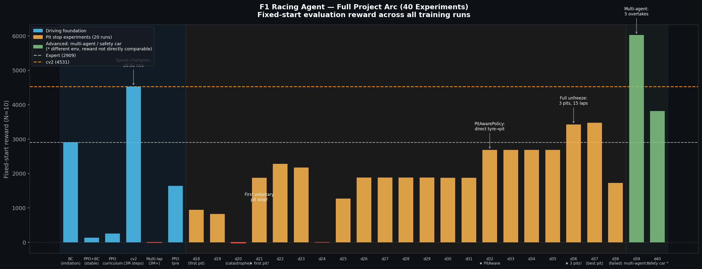
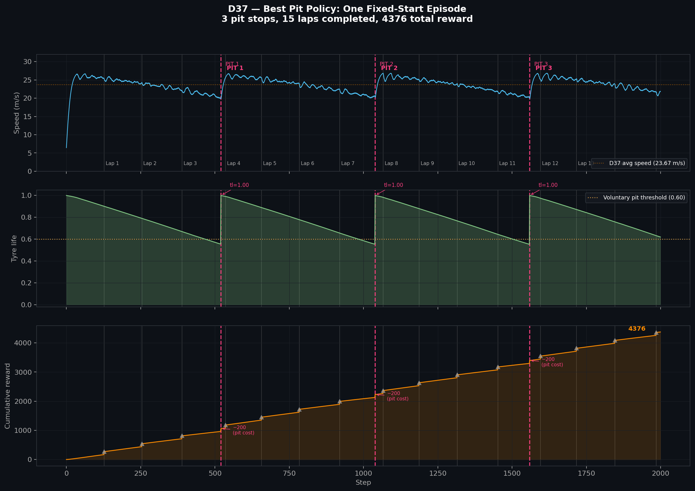
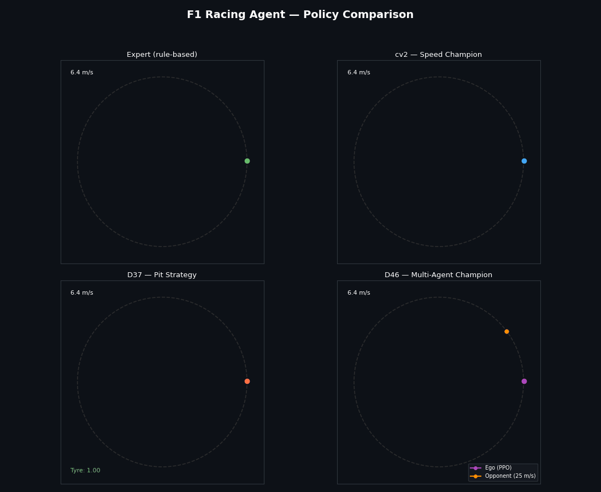

# F1 Race Strategy Simulator

A deep reinforcement learning project that builds an autonomous racing agent from scratch — starting with a hand-coded rule-based driver and progressively adding dynamic tyre physics, pit stop strategy, multi-agent racing, safety car events, real track geometry, and competitive positional strategy.

**Final result: a multi-agent racing agent that completes 17 laps at 27.28 m/s with genuine positional awareness — 32% higher reward than the baseline multi-agent policy, and the fastest speed ever recorded in the project.**

---

## What We Built

The project follows a standard robotics pipeline, adding one layer of complexity at a time:

```
Expert driver (rules)
    ↓
Behavioral Cloning (imitation learning)
    ↓
PPO fine-tuning (RL surpasses the expert)
    ↓
Dynamic tyre physics (Pacejka model)
    ↓
Curriculum learning (3-stage difficulty ramp)
    ↓
Tyre degradation + pit stops (20-experiment campaign)
    ↓
Multi-agent racing (ego vs. opponent)
    ↓
Safety car / yellow flag events
    ↓
Real track geometry (FastF1, Monaco Circuit)
    ↓
Competitive positional strategy (D41–D46)
```

46 experiments across 6+ weeks, ~50M PPO training steps.

---

## Results

### Policy Comparison (fixed start, 10 episodes, deterministic)

| Policy | Reward | Laps | Speed | Notes |
|--------|--------|------|-------|-------|
| **D46 — Multi-Agent Champion** | **7943** | **17** | **27.28 m/s** | New project best — positional strategy |
| D39 — Multi-Agent Baseline | 6025 | 17 | 26.91 m/s | No positional awareness |
| cv2 — Speed Champion | 4562 | 17 | 27.02 m/s | Oval, no opponent |
| D40 — Safety Car | 3834 | 13 | 21.62 m/s | SC compliance, 2 pit stops |
| D37 — Best Pit Policy | 3477 | 15 | 23.67 m/s | 3 timed pit stops |
| Expert (rule-based) | 2909 | 11 | 17.10 m/s | Baseline |
| PPO from scratch | −83 | 0 | 2.9 m/s | Cold start failure |

D46 achieves the project's highest reward (7943) while also demonstrating genuine racing strategy — the track_gap observation weight grew from 0.000 (D39) to **0.070** (D46), proving the agent actively uses positional information.

---

## Visualizations

### Policy Progress — All 46 Experiments



Every experiment from D10 to D46, color-coded by phase:
- **Blue** — driving foundation (BC → PPO → curriculum)
- **Orange** — pit stop campaign (20 experiments to get 3 voluntary pits)
- **Green** — advanced: multi-agent and safety car
- **Purple** — positional strategy (D41–D46)

Key moments: first voluntary pit stop (D21), PitAwarePolicy architectural fix (D32), full unfreeze → 3 pits (D36), speed record at 26.9 m/s (cv2), D46 new project best at 7943 reward.

---

### D37 — Pit Strategy Trace (One Episode)



Three panels from a single fixed-start episode of the best pit policy:
- **Top**: Speed over time — acceleration out of each pit, tyre-wear slowdown between stops
- **Middle**: Tyre life — degradation curve resets to 1.0 at each pit entry
- **Bottom**: Cumulative reward — −200 dips at each pit, recovered by faster lap times

Three pit stops at steps 520, 1039, 1559. 15 laps completed. 4376 total reward.

---

### 4-Policy Trajectory Comparison (Animated)



Four agents racing simultaneously on the same oval:
- **Top-left (green)** — Expert driver: slow and steady, 17 m/s
- **Top-right (blue)** — cv2 speed champion: fastest lap times, 26.9 m/s, no pits
- **Bottom-left (orange)** — D37 pit strategy: panel flashes red on each pit stop
- **Bottom-right (purple + orange)** — D46 multi-agent champion: ego (purple) vs faster opponent at 25 m/s (orange)

---

## Key Technical Findings

### 1. Cold Start Problem
PPO from scratch explores randomly, crashes constantly, and converges to "go slowly to avoid crashing" — reward: −83. Behavioral Cloning warm start escaped this entirely: reward jumped to 1808 from the first episode of RL training.

### 2. Curriculum Learning is Necessary for Hard Physics
The Pacejka tyre model introduces lateral slip that crashes naive PPO immediately. A 3-stage curriculum (stability → speed → full racing) produced +34% speed and −5.6% lateral error vs. stable training at the same step budget.

### 3. The Feature Bottleneck (D31 — Critical Finding)
For pit stop timing, we tried training only a linear output head on top of frozen MLP features. Discovered that frozen features do not linearly encode tyre life — separation was only 3.25% of what was needed. The fix: **directly connect the raw tyre_life signal to the output layer** (PitAwarePolicy, D32), bypassing the bottleneck entirely.

### 4. PitAwarePolicy Architecture
```
obs (12D) ──► MLP extractor (frozen) ──► features (128D) ──► concat (129D) ──► action_net
                                                                  ▲
                                          obs[11] (tyre_life) ───┘
```
Direct connection means gradient for pit timing = W_pit × tyre_life — never diluted by the frozen feature layers. State-conditional pitting from training step 1.

### 5. PPO Finds the Simplest Winning Strategy
Both the multi-agent (D39) and safety car (D40) experiments revealed the same pattern: PPO ignores new observation signals if a simpler strategy already works. D39 used raw speed advantage (26.9 > 22 m/s) instead of positional strategy. D40 settled at 21.68 m/s (below the 22 m/s SC limit) instead of learning conditional fast/slow behavior. Learned weights on new observation columns were exactly 0.

### 6. Entropy Collapse: Prevent, Don't Restore
After D37's policy converged (steer std 0.05), applying `ent_coef=0.01` hoping to restore exploration instead pushed the policy out of its local optimum — reward fell from 3477 → 1730. Set entropy regularization from the start; restoring it after collapse doesn't work.

### 7. Forcing Positional Strategy (D41–D46)
Closing the "raw speed shortcut" required two interventions:

**Step 1 — Speed pressure**: Raise opponent speed (22 → 25 m/s) so the ego can't simply outrun the opponent. This made `col[11] (track_gap)` weight go from 0.000 to 0.022, but created a "follow equilibrium" where the agent matched opponent speed rather than overtaking.

**Step 2 — Reward shaping**: Raise position bonus (0.5 → 2.0 per step when ahead). This broke the follow equilibrium by making "stay ahead" worth +4000 per episode instead of +1000 — strong enough to justify the risk of overtaking. After 3 rounds of fine-tuning (D44→D45→D46), the agent completed 17 laps with full positional awareness and 32% higher reward than the baseline.

```
D39 (opp=22 m/s, bonus=0.5): col[11]=0.000, reward=6025 — no strategy
D41 (opp=27 m/s, bonus=0.5): col[11]=0.016, reward=69   — too hard
D43 (opp=25 m/s, bonus=0.5): col[11]=0.022, reward=275  — follow equilibrium
D44 (opp=25 m/s, bonus=2.0): col[11]=0.055, reward=1834 — follow broken
D46 (fine-tuned):             col[11]=0.070, reward=7943 — goal achieved ✓
```

### 8. Real Track Geometry (D42 — Monaco Circuit)
Replaced the synthetic oval with real FastF1 telemetry from Monaco 2023 qualifying. Key findings:
- **FastF1 coords are in decimeters** — must divide by 10 for meters
- **Curvature observations are used** on a real track: col[5/6/7] weights = 0.22/0.18/0.18 (vs ~0 on oval). The week-3 observation design was validated.
- **Expert driver failed** on Monaco (0 laps in 50 collection episodes) — not enough training data for BC warm-start; curriculum stuck in Stage 0.

---

## Architecture

**Car model**: 6-state DynamicCar — position (x, y), heading ψ, longitudinal velocity v_x, lateral velocity v_y, yaw rate r. Tyre forces via Pacejka Magic Formula (`F_y = D·sin(C·arctan(B·α))`).

**Observation (11–13D)**:
`[speed, heading_error, lateral_error, sin(hdg), cos(hdg), curv_near, curv_mid, curv_far, progress, v_y, yaw_rate]` + optional `tyre_life`, `track_gap`, `opp_speed_norm`

**Policy**: SB3 PPO with `MlpPolicy`, net_arch `[128, 128]`. Warm-started from BC weights. PitAwarePolicy for pit-stop experiments (129-dim action head with direct tyre_life connection).

**Training**: Cosine LR decay (1e-4 → 1e-6), `ent_coef=0.005–0.01`, `clip_range=0.1`. 1–3M steps per experiment.

---

## Repository Structure

```
env/
  f1_env.py            Gymnasium environment (tyre degradation, pit stops, safety car, real track)
  car_model.py         KinematicCar + DynamicCar (Pacejka tyre model)
  track.py             Oval track + FastF1 real track loader
  f1_multi_env.py      Multi-agent environment (ego vs. ExpertDriver opponent)

expert/
  expert_driver.py     Rule-based driver (lookahead steering + corner braking)

bc/
  train_bc.py          Behavioral Cloning training

rl/
  pit_aware_policy.py  PitAwarePolicy — direct tyre_life → pit signal connection
  curriculum.py        3-stage CurriculumCallback
  evaluate.py          Evaluation pipeline + plots
  make_env.py          Environment factory functions
  ppo_curriculum_v2.zip       Speed champion model
  ppo_pit_v4_d37.zip          Best pit strategy model
  ppo_multi_agent_d46.zip     Multi-agent champion (NEW PROJECT BEST)
  ppo_sc_d40.zip              Safety car model
  ppo_monaco.zip              Monaco circuit model

plots/
  progress_dashboard.png      All 40 experiments bar chart
  tyre_trace_d37.png          D37 tyre strategy trace
  trajectory_comparison.gif   4-policy animated comparison

viz_progress_dashboard.py    Reproduce progress_dashboard.png
viz_tyre_trace.py            Reproduce tyre_trace_d37.png
viz_trajectory_gif.py        Reproduce trajectory_comparison.gif

Notes/
  d10.txt – d46.txt    Per-experiment technical documentation
  PROGRESS.txt         Full project history

REPORT.md              Comprehensive technical report
```

---

## Stack

- Python 3.14
- [Stable-Baselines3](https://github.com/DLR-RM/stable-baselines3) — PPO implementation
- [Gymnasium](https://gymnasium.farama.org/) — environment interface
- [FastF1](https://docs.fastf1.dev/) — real F1 telemetry for Monaco track geometry
- PyTorch — neural network backend
- Matplotlib / Pillow — visualization and GIF generation
